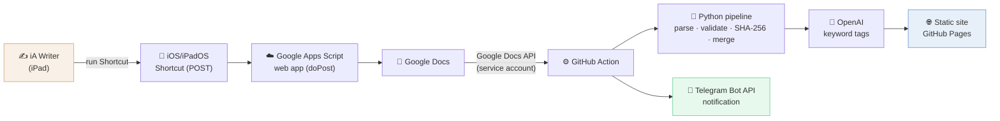

# Que Mal Poema — Portfolio Case Study

Live: [quemalpoema.com](https://quemalpoema.com) · Personal project · December 2025 – present

This file contains, for portfolio use:
1. Short project card (ES + EN)
2. Architecture diagram (Mermaid + ASCII fallback)
3. Full case study (ES + EN)

---

## 1. Short project card

### 🇪🇸 Tarjeta corta

**Que Mal Poema** — Plataforma de publicación poética diaria, automatizada de principio a fin. Escribo un poema en iA Writer, ejecuto un atajo en el iPad, y el sitio se actualiza solo: el contenido viaja por Google Apps Script, la API de Google Docs, OpenAI y GitHub Actions hasta publicarse en GitHub Pages, con notificación por Telegram. +160 entradas publicadas sin interrupción. Yo solo escribo; la tecnología hace el resto.

`Python` · `GitHub Actions` · `Google Docs API` · `OpenAI` · `Apps Script` · `Telegram Bot API` · `iOS Shortcuts` · `JavaScript`

### 🇬🇧 Short card

**Que Mal Poema** — A daily poetry platform, automated end to end. I write a poem in iA Writer, run a Shortcut on my iPad, and the site updates itself: content flows through Google Apps Script, the Google Docs API, OpenAI and GitHub Actions to publish on GitHub Pages, with a Telegram notification. 160+ entries published without interruption. I just write; the tech does the rest.

`Python` · `GitHub Actions` · `Google Docs API` · `OpenAI` · `Apps Script` · `Telegram Bot API` · `iOS Shortcuts` · `JavaScript`

---

## 2. Architecture diagram

### Mermaid



### ASCII fallback

```
  ✍️  iA Writer (iPad)
        │  write poem in plain text
        ▼
  📲 iOS/iPadOS Shortcut  ──POST──►  ☁️ Google Apps Script (doPost)
                                            │
                                            ▼
                                       📄 Google Docs
                                            │
                                            │  Google Docs API
                                            │  (service-account auth)
                                            ▼
  ⚙️ GitHub Action ──► 🐍 Python pipeline ──► 🤖 OpenAI (keywords)
        │              (parse · validate ·          │
        │               SHA-256 · merge)            ▼
        │                                    🌐 Static site
        │                                    (GitHub Pages)
        ▼
  🔔 Telegram notification: "published ✅"

  >> The only manual step is running the Shortcut. Everything else is automated.
```

---

## 3. Full case study

### 🇪🇸 ESPAÑOL

## Que Mal Poema — publicación poética diaria, totalmente automatizada

**quemalpoema.com** · Proyecto personal · Diciembre 2025 – presente

#### Resumen

*Que Mal Poema* es una plataforma de publicación poética diaria. Cada día sale una entrada con un poema original mío, un poema citado de otro autor y un análisis en prosa. Desde diciembre de 2025 lleva **más de 160 entradas publicadas sin interrupción**.

A primera vista es un sitio sencillo y limpio. Detrás hay un sistema de publicación completo, automatizado de principio a fin, que construí solo. **El objetivo era poder concentrarme al cien por cien en escribir, y delegar por completo la publicación y la actualización del sitio a la automatización.**

#### El problema

Quería publicar poesía a diario para cultivar mi pasión por la escritura y mejorar mi escritura creativa y analítica. Pero la constancia diaria choca con la fricción: dar formato, subir archivos, actualizar índices, desplegar el sitio. Si cada publicación me costaba tiempo y atención, el proyecto no sobreviviría.

La solución no era escribir menos, sino **eliminar por completo el trabajo manual de publicación**.

#### La solución: del iPad al sitio publicado, sin tocar nada más

El flujo de trabajo que diseñé es el corazón del proyecto:

1. **Escribo en iA Writer** en mi iPad, en texto plano.
2. **Ejecuto un atajo (Shortcut)** de iOS/iPadOS. Eso es todo lo que hago.
3. El atajo envía el texto (POST) a una **app web de Google Apps Script**, que parsea el contenido y lo escribe en el tab correcto de Google Docs.
4. Una **GitHub Action** extrae el contenido vía la **API de Google Docs** (autenticación con service account), genera los archivos de texto fuente y construye los metadatos.
5. **OpenAI** genera automáticamente las etiquetas (keywords) de cada entrada.
6. La acción hace commit, despliega el **sitio estático** en GitHub Pages y me **notifica por Telegram** que la entrada está publicada.

Desde que pulso «ejecutar» en el atajo hasta que el poema está en línea, no toco nada más. **Yo solo escribo.**

#### Stack técnico

| Capa | Tecnología |
|---|---|
| Entrada / escritura | iA Writer, Atajos de iOS/iPadOS |
| Puente de captura | Google Apps Script (web app `doPost`), gestionado con clasp |
| Contenido | Google Docs API (auth service-account) |
| Procesamiento | Python (parseo, validación, fingerprints SHA-256, merge de metadatos) |
| IA | OpenAI API (generación de keywords) |
| CI/CD | GitHub Actions (6 workflows: publicación, sweep por rangos, actualización, dry-run, smoke tests) |
| Notificaciones | Telegram Bot API |
| Frontend | JavaScript vanilla, HTML, CSS (sitio estático) |
| Hosting | GitHub Pages |

#### Retos técnicos resueltos

- **Renderizado tipográfico del poema:** los poemas necesitan sangrías e indentaciones precisas. Implementé un sistema de anclas (`|`) que mide la posición en píxeles con un canvas a partir de la fuente real renderizada, para alinear versos al píxel exacto, además de líneas alineadas a la derecha.
- **Detección de ediciones:** cada poema tiene un *fingerprint* SHA-256 sobre el texto normalizado, lo que permite detectar cuándo edito un texto en Google Docs y re-publicar solo lo que cambió.
- **Idempotencia y fiabilidad:** separé metadatos (en `archivo.json`) del texto de los poemas, con un flujo de *pending → merge* y validación previa, para que las publicaciones automáticas sean seguras y repetibles.
- **Gestión de secretos en CI:** las credenciales del service account se inyectan de forma segura en las Actions (escritas vía Python para evitar problemas de saltos de línea), sin exponer nada en el repositorio.

#### Resultados

- **+160 entradas publicadas** de forma continua desde diciembre de 2025.
- **Cero trabajo manual de publicación:** escribir y pulsar un atajo es todo el proceso.
- Un sitio sencillo de cara al público que esconde un pipeline completo: integraciones de API, automatización CI/CD y orquestación entre múltiples servicios.

#### Qué demuestra este proyecto

Construí solo un sistema de extremo a extremo —desde la captura en el móvil hasta el despliegue en producción— integrando varias APIs y servicios. Pero, sobre todo, nació de un problema real y personal: **usé la tecnología al servicio de una práctica creativa**, automatizando lo aburrido para proteger lo que importa, escribir.

---

### 🇬🇧 ENGLISH

## Que Mal Poema — a fully automated daily poetry platform

**quemalpoema.com** · Personal project · December 2025 – present

#### Overview

*Que Mal Poema* is a daily poetry publishing platform. Every day it ships one entry: an original poem of mine, a cited poem by another author, and a prose analysis. It has been running since December 2025 with **160+ entries published, every single day, without interruption.**

It looks like a simple, clean website. Behind it is a complete publishing system, automated end to end, that I built alone. **The goal was to focus 100% on writing and fully delegate publishing and site updates to automation.**

#### The problem

I wanted to publish poetry daily to nurture my passion for writing and sharpen my creative and analytical writing. But daily consistency runs into friction: formatting, uploading files, updating indexes, deploying the site. If every post cost me time and attention, the project wouldn't survive.

The answer wasn't to write less — it was to **remove the manual publishing work entirely.**

#### The solution: from iPad to live site, hands-off

The workflow I designed is the heart of the project:

1. **I write in iA Writer** on my iPad, in plain text.
2. **I run an iOS/iPadOS Shortcut.** That's the only thing I do.
3. The Shortcut POSTs the text to a **Google Apps Script web app**, which parses it and writes it to the correct tab in Google Docs.
4. A **GitHub Action** pulls the content via the **Google Docs API** (service-account auth), generates the source text files, and builds the metadata.
5. **OpenAI** automatically generates keyword tags for each entry.
6. The action commits, deploys the **static site** on GitHub Pages, and **notifies me on Telegram** that the entry is live.

From the moment I tap "run" on the Shortcut to the poem being online, I touch nothing else. **I just write.**

#### Tech stack

| Layer | Technology |
|---|---|
| Authoring | iA Writer, iOS/iPadOS Shortcuts |
| Capture bridge | Google Apps Script (web app `doPost`), managed with clasp |
| Content | Google Docs API (service-account auth) |
| Processing | Python (parsing, validation, SHA-256 fingerprints, metadata merge) |
| AI | OpenAI API (keyword generation) |
| CI/CD | GitHub Actions (6 workflows: publish, ranged sweep, update, dry-run, smoke tests) |
| Notifications | Telegram Bot API |
| Frontend | Vanilla JavaScript, HTML, CSS (static site) |
| Hosting | GitHub Pages |

#### Technical challenges solved

- **Poem typography rendering:** poems need precise indentation. I built an anchor system (`|`) that measures pixel positions via a canvas using the actually-rendered font, aligning verses to the exact pixel, plus right-aligned lines.
- **Edit detection:** each poem carries a SHA-256 fingerprint over normalized text, so I can detect when I edit something in Google Docs and re-publish only what changed.
- **Idempotency & reliability:** I separated metadata (in `archivo.json`) from poem text, with a *pending → merge* flow and pre-validation, so automated publishing is safe and repeatable.
- **Secrets in CI:** service-account credentials are injected securely into the Actions (written via Python to avoid newline issues), never exposed in the repository.

#### Results

- **160+ entries published** continuously since December 2025.
- **Zero manual publishing work:** writing and tapping a Shortcut is the whole process.
- A simple public-facing site hiding a full pipeline: API integrations, CI/CD automation, and orchestration across multiple services.

#### What this project demonstrates

I built a complete end-to-end system alone — from mobile capture to production deploy — integrating several APIs and services. But above all, it grew from a real, personal problem: **I put technology in service of a creative practice**, automating the boring parts to protect the part that matters — writing.
